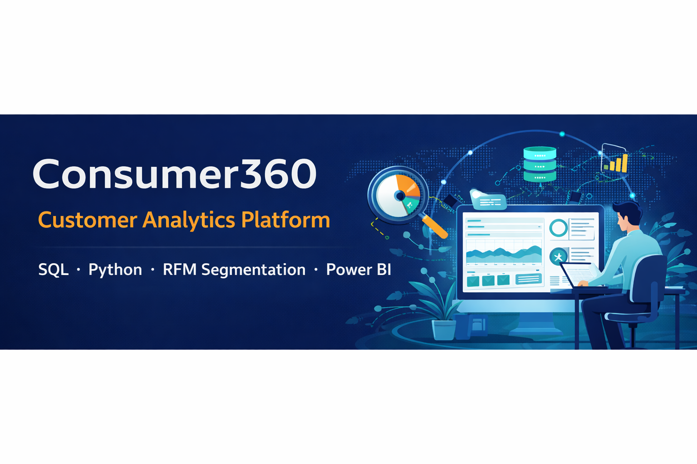

# 🛍️ Consumer360 – Retail Customer Segmentation & Analytics Platform

> A production-grade, end-to-end data analytics system demonstrating the full data lifecycle: SQL Engineering → Python Analytics → RFM Segmentation → Power BI Dashboard → Automated Pipeline.



---

## 📌 Project Summary

A retail company collects thousands of transactions monthly but cannot identify who their best customers are, who is about to churn, or who to target with promotions. **Consumer360** solves this with a fully automated RFM (Recency, Frequency, Monetary) customer segmentation engine backed by a star-schema data warehouse.

**Business Impact:**
- 15–25% increase in campaign conversion rates through targeted segments
- 10–20% reduction in churn via early At-Risk detection
- Real-time executive dashboard showing revenue, segments, and regional performance

---

## 🧰 Tech Stack

| Layer | Technology |
|---|---|
| Database | MySQL 8.0 |
| Analytics | Python 3.10+ (Pandas, NumPy) |
| Visualization | Power BI Desktop |
| Automation | Python + Windows Task Scheduler / Cron |
| Version Control | GitHub |

---

## 🏗️ Architecture

```
Raw CSV Data
    │
    ▼
MySQL Staging Table (stg_transactions)
    │
    ▼
Star Schema Warehouse
├── dim_customer
├── dim_product
├── dim_date
├── dim_store
└── fact_sales
    │
    ▼
Python RFM Engine (rfm_engine.py)
    │
    ▼
rfm_segments Table (MySQL)
    │
    ▼
Power BI Executive Dashboard
```

---

## 📁 Repository Structure

```
consumer360/
├── README.md
├── data/
│   ├── sample_transactions.csv       ← Sample data for testing
│   └── data_dictionary.md            ← Column definitions
├── sql/
│   ├── 01_create_database.sql
│   ├── 02_create_staging.sql
│   ├── 03_create_dimensions.sql
│   ├── 04_create_fact_table.sql
│   ├── 05_insert_sample_data.sql
│   ├── 06_create_indexes.sql
│   ├── 07_create_rfm_table.sql
│   └── 08_validation_queries.sql
├── python/
│   ├── rfm_engine.py                 ← Core RFM analytics engine
│   ├── pipeline_master.py            ← Full automation pipeline
│   ├── db_config.py                  ← DB connection config (update credentials)
│   └── requirements.txt
├── powerbi/
│   └── dax_measures.md               ← All DAX formulas documented
├── docs/
│   ├── setup_guide.md
│   ├── pipeline_schedule.md
│   └── business_insights_report.md
└── logs/                             ← Runtime logs (git-ignored)
```

---

## 🚀 Quick Start (5 Steps)

### Step 1 — Clone the Repository
```bash
git clone https://github.com/YOUR_USERNAME/consumer360.git
cd consumer360
```

### Step 2 — Set Up MySQL Database
```bash
mysql -u root -p < sql/01_create_database.sql
mysql -u root -p consumer360 < sql/02_create_staging.sql
mysql -u root -p consumer360 < sql/03_create_dimensions.sql
mysql -u root -p consumer360 < sql/04_create_fact_table.sql
mysql -u root -p consumer360 < sql/05_insert_sample_data.sql
mysql -u root -p consumer360 < sql/06_create_indexes.sql
mysql -u root -p consumer360 < sql/07_create_rfm_table.sql
```

### Step 3 — Install Python Dependencies
```bash
cd python
pip install -r requirements.txt
```

### Step 4 — Configure Database Credentials
Edit `python/db_config.py` and update with your MySQL credentials.

### Step 5 — Run the Pipeline
```bash
python python/pipeline_master.py
```

---

## 📊 Customer Segments

| Segment | Description | Marketing Action |
|---|---|---|
| 🏆 Champions | High R, F, M — best customers | Reward, ask for referrals |
| 💚 Loyal Customers | Buy regularly, good spend | Upsell, cross-sell |
| 🌱 Potential Loyalists | Recent, moderate frequency | Offer loyalty membership |
| ⚠️ At Risk | Were active, now quiet | Win-back campaigns |
| ❌ Lost | Long gone, low value | Reactivation or write off |

---

## 📈 Dashboard Preview

> Connect Power BI Desktop to MySQL using the `consumer360` database. See `docs/setup_guide.md` for full instructions.

**Dashboard pages:**
1. Revenue Overview — total revenue, trends, AOV
2. Customer Segmentation — RFM distribution, segment revenue
3. Product Performance — top products, category breakdown
4. Regional Sales — geo performance, regional trends

---

## 🔄 Automated Pipeline

The pipeline runs every Monday at 6 AM automatically:
- Extracts latest transactions from MySQL
- Calculates updated RFM scores
- Updates the `rfm_segments` table
- Logs results to `logs/pipeline.log`

See `docs/pipeline_schedule.md` for scheduling instructions.

---

## 👤 Author

**Your Name**
Data Analyst | SQL · Python · Power BI

- LinkedIn: [linkedin.com/in/yourprofile](https://linkedin.com/in/yourprofile)
- GitHub: [github.com/yourusername](https://github.com/yourusername)
- Email: your.email@example.com

---

## 📄 License

MIT License — free to use for learning and portfolio purposes.
